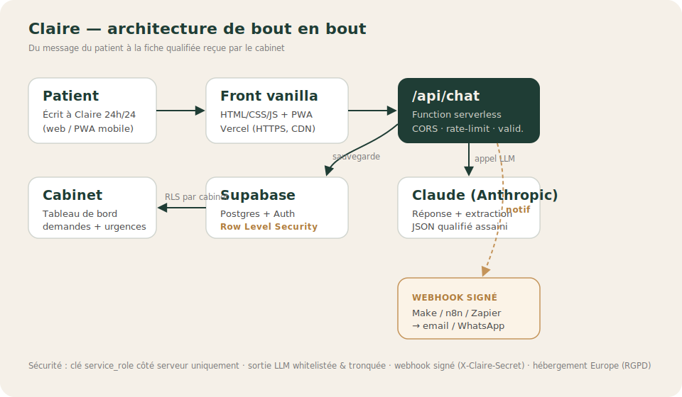

# Claire Platform — V1

Plateforme cabinet pour Claire, l'assistante de réception en ligne pour cabinets dentaires.

## Stack

- **Frontend** : HTML/CSS/JS vanilla (palette Fraunces + Inter Tight, cohérente avec claireassistante.fr)
- **Backend** : Vercel Serverless Functions (Node.js)
- **Base de données + Auth** : Supabase
- **Hébergement** : Vercel
- **Automatisations** : Make / n8n / Zapier (via webhook signé) — voir `docs/MAKE.md`

## Architecture



Étude de cas complète (problème, solution, décisions d'ingénierie) : **`etude-de-cas.html`**.

## Structure

```
claire-platform/
├── index.html               → Landing publique (démo live, FAQ, programme fondateurs, SEO)
├── etude-de-cas.html        → Étude de cas produit/technique (portfolio public)
├── login.html               → Connexion cabinet
├── cabinet.html             → Dashboard accueil
├── conversations.html       → Liste des conversations Claire ↔ patients
├── conversation.html        → Détail d'une conversation
├── demandes.html            → Demandes qualifiées à traiter
├── parametres.html          → Paramètres du cabinet
├── mentions-legales.html    → Mentions légales (identité à compléter)
├── confidentialite.html     → Politique de confidentialité (RGPD)
├── robots.txt / sitemap.xml → SEO
│
├── css/
│   ├── styles.css           → Styles globaux (palette commune)
│   └── dashboard.css        → Styles spécifiques dashboard
│
├── js/
│   ├── supabase-client.js   → Initialisation client Supabase
│   ├── auth.js              → Login / logout / guard
│   ├── format.js            → Helpers d'affichage partagés (dates, libellés, échappement HTML)
│   ├── pwa.js               → Enregistrement du service worker (app installable)
│   ├── demo-chat.js         → Widget de démo de la page d'accueil (→ /api/chat)
│   ├── contact-form.js      → Formulaire « Réserver une démo » (→ /api/contact)
│   ├── track.js             → Suivi de conversion cookieless (Vercel Analytics)
│   ├── dashboard.js         → Logique dashboard accueil
│   ├── conversations.js     → Liste + détail conversations
│   ├── demandes.js          → Gestion des demandes
│   └── parametres.js        → Gestion paramètres
│
├── icons/                   → Icônes PWA, favicon, image de partage (Open Graph)
├── manifest.webmanifest     → Manifest PWA (app installable)
├── sw.js                    → Service worker (cache app shell, hors-ligne)
│
├── api/
│   ├── chat.js              → Endpoint chatbot (sauvegarde dans Supabase)
│   ├── contact.js           → Réception des leads (formulaire de démo)
│   ├── demo-summary.js      → Résumé qualifié de la démo (cabinet démo uniquement)
│   ├── conversations.js     → GET liste conversations cabinet
│   ├── conversation.js      → GET détail conversation
│   ├── demandes.js          → GET / PATCH demandes
│   ├── cabinet.js           → GET / PATCH cabinet
│   └── _supabase.js         → Helper Supabase server-side
│
├── sql/
│   ├── schema.sql           → Schéma complet à exécuter dans Supabase
│   └── demo-cabinet.sql     → Crée le cabinet de démo (page d'accueil)
│
├── scripts/
│   └── check.mjs            → Contrôles légers (syntaxe JS, JSON, JSON-LD) — sert de lint/test
├── .github/workflows/
│   └── checks.yml           → CI : `npm run check` sur chaque PR et push `main`
├── docs/
│   ├── DEPLOIEMENT.md       → Guide de déploiement détaillé, pas à pas
│   ├── MAKE.md              → Recette Make pour les notifs cabinet (webhook)
│   ├── TESTS.md             → Scénarios de test manuels
│   ├── PORTFOLIO.md         → Éléments CV / LinkedIn prêts à copier
│   ├── PITCH-CABINETS.md    → Script d'approche des cabinets (programme fondateurs)
│   └── HOOK-SESSION.md      → Hook de dev Claude Code (optionnel, sans impact prod)
│
├── MISE-EN-LIGNE.md         → Checklist 15 min pour passer en prod
├── AUDIT.md                 → Audit du projet (état, choix, vérifications)
├── package.json
├── vercel.json
└── .env.example             → Variables d'env à configurer
```

## Documentation

Le README est le point d'entrée. Pour le détail :

- **`MISE-EN-LIGNE.md`** — checklist des 3 actions de config restantes avant prod (≈15 min)
- **`docs/DEPLOIEMENT.md`** — guide complet pas à pas (Supabase, Vercel, démo, PWA, analytics)
- **`docs/MAKE.md`** — brancher les notifications cabinet sur Make (webhook)
- **`docs/TESTS.md`** — scénarios de test manuels avant mise en ligne
- **`docs/PORTFOLIO.md`** — éléments CV / LinkedIn prêts à copier
- **`docs/PITCH-CABINETS.md`** — script d'approche des cabinets (programme fondateurs)
- **`AUDIT.md`** — état du projet, décisions et vérifications
- **`docs/HOOK-SESSION.md`** — hook de dev optionnel pour Claude Code on the web

## Setup (étapes à suivre une fois)

### 1. Créer le projet Supabase

1. Va sur https://supabase.com → crée un nouveau projet (région : Europe West)
2. Note bien : `SUPABASE_URL`, `SUPABASE_ANON_KEY`, `SUPABASE_SERVICE_ROLE_KEY`
3. Dans le SQL Editor, copie/colle le contenu de `sql/schema.sql` et exécute.

### 2. Créer un compte cabinet de test

Dans Supabase → Authentication → Add user (manuel) :
- Email : `test@cabinet-demo.fr`
- Password : choisis-en un solide
- Auto Confirm User : ✅

Puis dans le SQL Editor, exécute :
```sql
insert into cabinets (id, nom, email, telephone)
values ('<UUID-de-l-utilisateur-créé>', 'Cabinet Demo Lyon', 'test@cabinet-demo.fr', '+33605800594');
```

(L'UUID se récupère dans Authentication → Users → clic sur l'utilisateur)

### 3. Configurer Vercel

1. Push ce repo sur GitHub
2. Importe le repo sur https://vercel.com
3. Dans Settings → Environment Variables, ajoute :
   - `SUPABASE_URL`
   - `SUPABASE_ANON_KEY`
   - `SUPABASE_SERVICE_ROLE_KEY`
   - `ANTHROPIC_API_KEY` (pour le chatbot Claire)
   - `ALLOWED_ORIGINS` (origines autorisées pour `/api/chat` et `/api/contact`)
   - `NOTIFY_WEBHOOK_URL` (optionnel, notifs au cabinet via Make/n8n/Zapier — voir `docs/MAKE.md`)
   - `DEMO_CABINET_ID` (optionnel — active la carte « reçu par le cabinet » de la démo ;
     voir `docs/DEPLOIEMENT.md`)
4. Configure aussi ces deux mêmes variables dans `js/supabase-client.js` (côté navigateur) :
   - Remplace `SUPABASE_URL_HERE` et `SUPABASE_ANON_KEY_HERE` par les vraies valeurs
   - ⚠️ NE JAMAIS exposer la SERVICE_ROLE_KEY côté navigateur

### 4. Tester en local (optionnel)

```bash
npm install
vercel dev
```

Puis va sur `http://localhost:3000/login.html`.

### 5. Déployer

`git push` → Vercel déploie automatiquement.

## Qualité / CI

Contrôles légers sans dépendance, qui servent de linter et de test :

```bash
npm run check     # syntaxe JS, validité JSON, JSON-LD, présence des fichiers SEO/PWA
```

`.github/workflows/checks.yml` exécute `npm run check` automatiquement sur chaque pull request
et sur les push vers `main` (Node 22).

## Sécurité

- **Row Level Security (RLS)** activé sur toutes les tables : chaque cabinet ne voit que ses propres données.
- **Auth Supabase** : sessions JWT côté navigateur, vérification côté API.
- **Service role key** : utilisée uniquement côté serveur (API routes), jamais exposée au navigateur.

## Roadmap

### V1 (livrée ici)
- ✅ Login cabinet
- ✅ Dashboard avec KPIs du jour
- ✅ Liste + détail des conversations Claire ↔ patients
- ✅ Demandes qualifiées avec actions (traité, à rappeler)
- ✅ Paramètres cabinet (horaires, infos)
- ✅ Webhook signé (Make/n8n/Zapier) pour notifs email/SMS
- ✅ Page d'accueil avec démo interactive (branchée sur `/api/chat`)
- ✅ Carte « reçu par le cabinet » dans la démo (`/api/demo-summary`)
- ✅ Formulaire « Réserver une démo » → leads (`/api/contact`)
- ✅ App mobile installable (PWA : manifest + service worker)
- ✅ SEO (Open Graph, JSON-LD, sitemap, robots) + mesure de conversion cookieless
- ✅ Pages légales (mentions, confidentialité) + CI de contrôle

### V2 (plus tard)
- Multi-utilisateurs par cabinet
- Statistiques avancées
- Intégration agenda (Doctolib, Julie)
- Notifications push (PWA)
